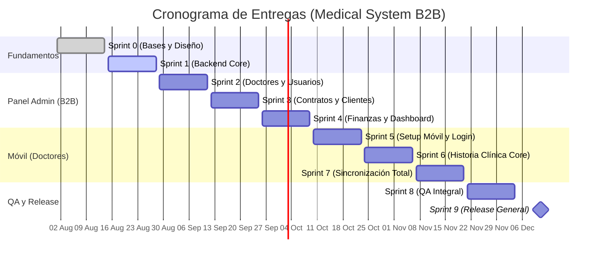

# 🗓️ Master Project Roadmap: Medical Management System (B2B)

> [!NOTE]
> Este documento centraliza el cronograma del proyecto de acuerdo a los requerimientos del ecosistema B2B, programando avances y entregables cada dos semanas (viernes) con meta final de release para el **11 de Diciembre de 2026**.

## 🗺️ Visual Gantt Chart (Overview)

## 📦 Detalle de Entregas por Sprint

Cada dos viernes tenemos un corte de entrega donde le mostraremos al cliente un avance funcional (Demostración).

| Fecha | Sprint | Foco Principal | 🔍 ¿Qué revisará el cliente? (Entregable Visual) |
| :--- | :--- | :--- | :--- |
| **14 Ago** | Sprint 0 | **Identidad y Landing** | Aprobación del sistema de diseño (Look & Feel), y la web explicativa B2B (Landing). Maqueta base del Admin. |
| **28 Ago** | Sprint 1 | **Infraestructura y Auth** | Revisión interna técnica. Prueba de inicio de sesión (Login) en el ambiente de desarrollo. |
| **11 Sep** | Sprint 2 | **Core Administrativo** | El cliente podrá navegar el sistema admin y ver la pantalla para dar de alta/baja a Doctores y usuarios internos. |
| **25 Sep** | Sprint 3 | **Operación B2B** | **Momento clave:** El cliente creará una empresa de prueba y verá cómo el sistema autogenera un contrato PDF de prestación de servicios. |
| **09 Oct** | Sprint 4 | **Finanzas y Reportes** | El cliente verá el *Dashboard* y el calendario cobrando vida con datos simulados (módulo de caja y métricas operativas). |
| **23 Oct** | Sprint 5 | **Inicio App Móvil** | El cliente podrá instalar la app base de React Native en su teléfono (vía Expo Go) y loguearse como un Doctor. |
| **06 Nov** | Sprint 6 | **App Móvil Core** | Navegación dentro de la app móvil. El doctor (o cliente probando) podrá simular una consulta y rellenar un formulario clínico. |
| **20 Nov** | Sprint 7 | **Sincronización Total** | Flujo completo: Lo que el doctor capture en la app móvil (Historia Clínica), el cliente lo verá reflejado al instante en el Admin. |
| **04 Dic** | Sprint 8 | **Pruebas Integrales (QA)** | Sesión de "Bug Bash". El cliente utilizará todas las plataformas buscando romperlas para asegurar robustez. |
| **11 Dic** | **Sprint 9** | **🎯 Release General** | **Sign-off final.** El sistema se despliega a producción listo para operar con el primer corporativo real (ej. Coca-Cola). |

> [!TIP]
> **Metodología de Revisiones:** Para las demostraciones quincenales, nunca utilices bases de datos vacías. Siempre inyecta datos semilla (seeds) para que el cliente perciba el volumen y la utilidad real del software.
